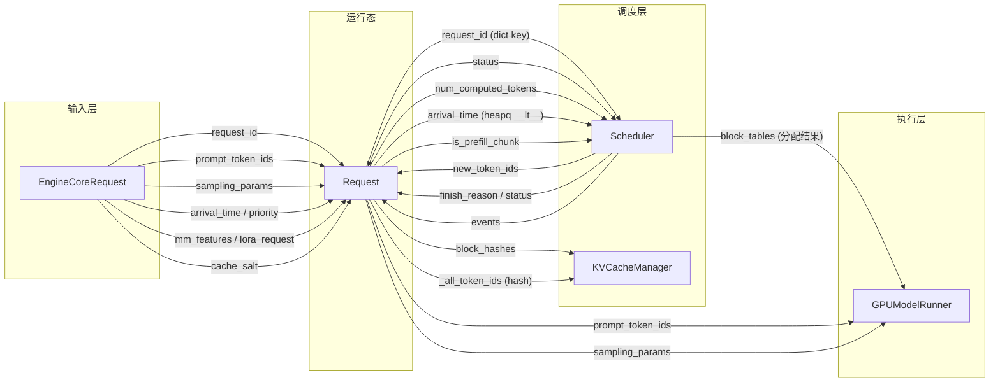

# vLLM 动态期：请求到来后的完整主线

## 0. 总览图：动态期一轮链路

```mermaid
graph TD
    subgraph API["API Server 进程"]
        A["HTTP JSON<br/>(user prompt + params)"]
        B["ChatCompletionRequest<br/><i>Pydantic 模型</i>"]
        C["Renderer<br/><i>chat template + tokenize</i>"]
        D["EngineInput<br/><i>dict: prompt_token_ids</i>"]
        E["InputProcessor.process_inputs()<br/><i>校验 + 补全参数</i>"]
        F["EngineCoreRequest<br/><i>msgspec.Struct (高性能序列化)</i>"]
    end

    subgraph IPC["ZMQ IPC 边界"]
        G["msgpack.encode → ZMQ DEALER → msgpack.decode"]
    end

    subgraph ENGINE["EngineCore 进程"]
        H["preprocess_add_request()<br/><i>MM 解析 + grammar init</i>"]
        I["Request<br/><i>Scheduler 内部运行态对象</i>"]
        J["Scheduler.add_request()<br/><i>→ waiting queue</i>"]

        K["EngineCore.step()"]
        L["Scheduler.schedule()<br/><i>选请求 + 分 block</i>"]
        M["SchedulerOutput<br/><i>本轮执行计划</i>"]
        N["ModelExecutor.execute_model()<br/><i>→ GPU forward + sampling</i>"]
        O["ModelRunnerOutput<br/><i>sampled_token_ids</i>"]
        P["Scheduler.update_from_output()<br/><i>更新 token + 状态</i>"]
        Q["EngineCoreOutputs<br/><i>新 token + 完成状态</i>"]
    end

    subgraph OUT["API Server 进程"]
        R["OutputProcessor / Detokenizer<br/><i>token → 文本</i>"]
        S["HTTP SSE Stream<br/><i>返回给用户</i>"]
    end

    A --> B --> C --> D --> E --> F
    F ==> G ==> H
    H --> I --> J

    J -.->|"请求入队完成"| K
    K --> L --> M
    M ==> N --> O
    O --> P --> Q

    Q ==>|"ZMQ IPC"| R --> S

    style API fill:#1a1a2e,stroke:#e94560,color:#fff
    style IPC fill:#0f3460,stroke:#e94560,color:#fff
    style ENGINE fill:#16213e,stroke:#0f3460,color:#fff
    style OUT fill:#1a1a2e,stroke:#e94560,color:#fff
```



### 关键要点（面试用）

| 要点 | 一句话 |
|------|--------|
| **进程边界** | Renderer/InputProcessor 在 API Server 进程，Scheduler/Executor 在 EngineCore 进程，通过 ZMQ IPC 通信 |
| **序列化** | `EngineCoreRequest` 用 `msgspec.msgpack` 序列化，比 pickle 快 20x |
| **转换链** | HTTP JSON → Pydantic → EngineInput(dict) → EngineCoreRequest(msgspec) → Request(Python对象) |
| **入队点** | `Scheduler.add_request()` 把 Request 加入 waiting queue + requests dict |
| **调度点** | `step()` 每轮调用 `scheduler.schedule()` 从 waiting 中取出请求 |
| **输出增量** | `EngineCoreOutput.new_token_ids` 只含本次新生成的 token（增量设计） |

---

## 1. API / Renderer / InputProcessor：从 HTTP 到 EngineCoreRequest

> 本节覆盖：HTTP JSON → ChatCompletionRequest → Renderer（chat template + tokenize）→ EngineInput → InputProcessor → EngineCoreRequest
> 所有代码运行在 **API Server 进程**（与 EngineCore 不同进程，通过 ZMQ IPC 通信）

### 1.1 HTTP 端点接收 JSON

```python
# vllm/entrypoints/openai/chat_completion/api_router.py L40-74
@router.post("/v1/chat/completions")
async def create_chat_completion(
    request: ChatCompletionRequest,   # FastAPI 自动从 JSON body 解析
    raw_request: Request,             # FastAPI 原始请求（headers、app state）
):
    handler: OpenAIServingChat = request.app.state.openai_serving_chat
    return await handler.create_chat_completion(request, raw_request)
```

**输入**：`ChatCompletionRequest`（Pydantic 模型，包含 messages、temperature、max_tokens 等）

**输出**：交给 `OpenAIServingChat` 处理

### 1.2 OpenAIServingChat：协调层

```python
# vllm/entrypoints/openai/chat_completion/serving.py L229-351
async def create_chat_completion(self, request: ChatCompletionRequest, ...):
    # 1. Renderer：chat template + tokenize + 多模态处理
    conversation_messages, engine_inputs = await self.render_chat_request(request)

    # 2. 构造 SamplingParams
    sampling_params = request.to_sampling_params()

    # 3. 发起推理
    await self.engine_client.generate(engine_input, sampling_params, request_id, ...)
```

**关键**：`render_chat_request()` 是核心转换步骤，下面展开。

### 1.3 Renderer：chat template + tokenize

```python
# vllm/entrypoints/serve/render/serving.py L184-267
async def render_chat(self, request: ChatCompletionRequest, ...):
    # 1. 构造 ChatParams（template 配置）和 TokenizeParams（tokenizer 配置）
    # 2. 调用 BaseRenderer 的三步管线
    engine_inputs = await renderer.render_chat_async([messages], chat_params, tok_params, ...)
    return conversation_messages, engine_inputs
```

**BaseRenderer.render_chat_async** 内部三步管线：

```python
# vllm/renderers/base.py L1007-1045
async def render_chat_async(self, conversations, chat_params, tok_params, ...):
    # Step 1: 应用 Jinja2 chat template
    #   HfRenderer.render_messages() → tokenizer.apply_chat_template()
    #   输入: [{"role":"user","content":"Hello"}]
    #   输出: "<|system|>...\n<|user|>Hello\n<|assistant|>" (文本或 token_ids)
    out_conversations = await self.render_messages_async(...)

    # Step 2: Tokenize（如果 Step 1 输出是文本）
    #   tokenizer.encode(prompt_text) → TokensPrompt(prompt_token_ids=[1,2,3,...])
    tok_prompts = await self.tokenize_prompts_async(...)

    # Step 3: 转为 EngineInput
    #   TokensPrompt → TokensInput {"type":"tokens","prompt_token_ids":[...]}
    #   多模态: 运行 mm_processor，附加 mm_features
    eng_prompts = await self.process_for_engine_async(...)
    return out_conversations, eng_prompts
```

**数据类型转换**：

```
[{"role":"user","content":"Hello"}]    ← 原始 messages
        ↓  apply_chat_template (Jinja2)
"<|user|>Hello\n<|assistant|>"         ← 拼接后的文本
        ↓  tokenizer.encode()
[15496, 9906, 198]                     ← token IDs
        ↓  process_for_engine()
{"type":"tokens",                      ← EngineInput (dict)
 "prompt_token_ids":[15496,9906,198]}
```

### 1.4 InputProcessor：EngineInput → EngineCoreRequest

```python
# vllm/v1/engine/input_processor.py L234-377
def process_inputs(
    self,
    request_id: str,
    prompt: PromptType | EngineInput,    # Renderer 输出的 dict
    params: SamplingParams | PoolingParams,
    ...
) -> EngineCoreRequest:
    # 1. 校验 params
    _validate_params(params)

    # 2. 如果是 EngineInput（有 "type" key），直接使用（现代路径）
    #    如果是旧格式 PromptType，需要额外处理

    # 3. 分离 encoder/decoder 输入（多模态模型：encoder=图片，decoder=文本）
    encoder_inputs, decoder_inputs = split_enc_dec_input(prompt)

    # 4. 提取 prompt_token_ids 或 prompt_embeds
    prompt_token_ids = decoder_inputs.get("prompt_token_ids")
    prompt_embeds = decoder_inputs.get("prompt_embeds")

    # 5. 多模态：mm_placeholders/mm_hashes/mm_kwargs → list[MultiModalFeatureSpec]
    mm_features = ...

    # 6. 克隆并补全 SamplingParams（填默认 max_tokens 等）
    sampling_params = _clone_and_update_params(params, ...)

    # 7. 构造 EngineCoreRequest
    return EngineCoreRequest(
        request_id=request_id,
        prompt_token_ids=prompt_token_ids,
        mm_features=mm_features,
        sampling_params=sampling_params,
        arrival_time=arrival_time,
        lora_request=lora_request,
        priority=priority,
        ...
    )
```

**数据类型转换**：

```
EngineInput (dict)                     ← Renderer 输出
  + SamplingParams (dataclass)         ← HTTP 参数
        ↓  InputProcessor.process_inputs()
EngineCoreRequest (msgspec.Struct)     ← 高性能序列化对象，准备发往 EngineCore 进程
```

### 1.5 节 1 总结

```
代码位置
  HTTP 端点:    api_router.py L40-74
  协调层:       serving.py L229-351
  Renderer:     renderers/base.py L1007-1045 (三步管线)
  InputProcessor: v1/engine/input_processor.py L234-377
    ↓
做了什么
  HTTP JSON → Pydantic 模型 → chat template 应用 → tokenize → EngineInput
  → InputProcessor 校验/补全参数 → 构造 EngineCoreRequest
    ↓
数据类型链
  ChatCompletionRequest (Pydantic)
    → EngineInput (dict: {"type":"tokens","prompt_token_ids":[...]})
    → EngineCoreRequest (msgspec.Struct)
    ↓
使用模块
  Renderer:      vllm/renderers/hf.py (HfRenderer，chat template + tokenize)
  InputProcessor: vllm/v1/engine/input_processor.py (参数校验 + 构造 EngineCoreRequest)
  AsyncLLM:      vllm/v1/engine/async_llm.py L349 (调用 process_inputs)
    ↓
传递给下一步
  EngineCoreRequest → 通过 ZMQ IPC 发往 EngineCore 进程
  下一步: EngineCore.preprocess_add_request() (见节 2)
```

---

## 2. EngineCore ingress：从 EngineCoreRequest 到 Request

> 本节覆盖：EngineCoreRequest（ZMQ 反序列化）→ preprocess_add_request → Request.from_engine_core_request → Request
> 所有代码运行在 **EngineCore 进程**（与 API Server 不同进程）

### 2.1 ZMQ 接收 + 反序列化

```
API Server 进程                          EngineCore 进程
  │                                        │
  │  EngineCoreRequest                     │
  │  (msgspec.msgpack.encode)              │
  │ ──→ ZMQ DEALER socket ──→             │
  │                                        │  Input Thread (ZMQ recv)
  │                                        │  msgspec.msgpack.decode → EngineCoreRequest
  │                                        │  input_queue.put((ADD, request))
  │                                        │
  │                                        │  主循环: input_queue.get()
  │                                        │  → _handle_client_request()
  │                                        │  → preprocess_add_request()
```

### 2.2 preprocess_add_request

```python
# vllm/v1/engine/core.py L765-787
def preprocess_add_request(self, request: EngineCoreRequest) -> tuple[Request, int]:
    # 1. 多模态 feature 解析（分布式场景：从其他进程获取 MM 张量）
    if self.mm_receiver_cache and request.mm_features:
        self.mm_receiver_cache.get_and_update_features(request.mm_features)

    # 2. EngineCoreRequest → Request
    req = Request.from_engine_core_request(request, self.request_block_hasher)

    # 3. 结构化输出 grammar 初始化（如果有 JSON Schema / 正则约束）
    if req.structured_output_request is not None:
        self.structured_output_manager.grammar_init(req)

    # 4. 返回 Request + wave（DP 同步用）
    return req, request.current_wave
```

### 2.3 Request.from_engine_core_request

```python
# vllm/v1/request.py L186-209
@classmethod
def from_engine_core_request(
    cls,
    request: EngineCoreRequest,
    block_hasher: Callable[["Request"], list["BlockHash"]] | None,
) -> "Request":
    return cls(
        request_id=request.request_id,
        prompt_token_ids=request.prompt_token_ids,
        sampling_params=request.sampling_params,
        pooling_params=request.pooling_params,
        arrival_time=request.arrival_time,
        prompt_embeds=request.prompt_embeds,
        mm_features=request.mm_features,
        lora_request=request.lora_request,
        cache_salt=request.cache_salt,
        priority=request.priority,
        client_index=request.client_index,
        resumable=request.resumable,
        block_hasher=block_hasher,
        reasoning_ended=request.reasoning_ended,
        ...
    )
```

**Request.__init__ 额外做的事**（L60-183）：

```python
# 1. 从 sampling_params 创建 StructuredOutputRequest（JSON Schema 约束）
self.structured_output_request = StructuredOutputRequest.from_sampling_params(sampling_params)
if self.structured_output_request is not None:
    self.status = RequestStatus.WAITING_FOR_STRUCTURED_OUTPUT_GRAMMAR  # 需要先编译 grammar

# 2. 设置初始状态
self.status = RequestStatus.WAITING
self.events: list[EngineCoreEvent] = []

# 3. 初始化 token 列表
self._output_token_ids: list[int] = []                              # 空，等待生成
self._all_token_ids: list[int] = self.prompt_token_ids.copy()       # prompt 副本
self.output_token_ids = ConstantList(self._output_token_ids)        # 只读视图
self.all_token_ids = ConstantList(self._all_token_ids)              # 只读视图

# 4. 计算初始 block hashes（前缀缓存）
self.block_hashes = block_hasher(self) if block_hasher else []
```

### 2.4 EngineCore.add_request

```python
# vllm/v1/engine/core.py L315-346
def add_request(self, request: Request, request_wave: int = 0):
    # 1. 校验 request_id 类型
    if not isinstance(request.request_id, str):
        raise TypeError(...)

    # 2. 校验 pooling 任务支持
    if pooling_params := request.pooling_params:
        ...

    # 3. 转交 Scheduler
    self.scheduler.add_request(request)
```

**Scheduler.add_request 内部**：

```python
# scheduler 将 Request 加入 waiting queue（FCFS 或 Priority）
self.requests[request.request_id] = request   # 注册到全局 dict
self.waiting.add(request)                      # 加入等待队列
```

### 2.5 节 2 总结

```
代码位置
  ZMQ 反序列化:  v1/engine/core.py (EngineCoreProc Input Thread)
  preprocess:   v1/engine/core.py L765-787
  from_ecr:     v1/request.py L186-209
  add_request:  v1/engine/core.py L315-346
    ↓
做了什么
  EngineCoreRequest (msgspec 反序列化)
  → 解析多模态 feature
  → Request.from_engine_core_request() 逐字段拷贝
  → Request.__init__() 额外创建 StructuredOutputRequest、初始化 token 列表、计算 block hash
  → add_request() 校验后转交 Scheduler
    ↓
数据类型链
  EngineCoreRequest (msgspec.Struct, ZMQ 传入)
    → Request (Python 对象, Scheduler 内部使用)
    ↓
新增的状态
  Request.status = WAITING (或 WAITING_FOR_STRUCTURED_OUTPUT_GRAMMAR)
  Request._output_token_ids = [] (空，等待 step() 生成)
  Request._all_token_ids = prompt_token_ids 的副本
  Request.block_hashes = 初始前缀缓存 hash
    ↓
传递给下一步
  Request 进入 Scheduler.waiting 队列
  下一步: step() → scheduler.schedule() 从 waiting 中取出请求（见节 5-6）
```

## 3. Request：Scheduler 运行态对象

> 源码: `vllm/v1/request.py` L59-308
> 由 `Request.from_engine_core_request()` 从 `EngineCoreRequest` 转换而来
> 是 Scheduler、KVCacheManager、GPUModelRunner 三者共同操作的核心对象

### 3.1 输入相关字段

| 字段 | 类型 | 传递来源 | 数据结构 | 作用 | 使用模块 |
|------|------|---------|---------|------|---------|
| `request_id` | `str` | EngineCoreRequest.request_id | 不可变字符串 | 全局唯一标识，在几万并发中追踪请求。贯穿整个生命周期，从入队到输出都用它做 key | Scheduler（requests dict）、EngineCoreOutputs（outputs）、OutputProcessor |
| `prompt_token_ids` | `list[int] \| None` | EngineCoreRequest.prompt_token_ids | Python list，Tokenizer 输出 | 输入文本的 Token ID 序列。`None` 时说明输入是 embedding（prompt_embeds 非空） | Scheduler（计算 prompt 长度）、GPUModelRunner（写入 input_ids buffer）、BlockHasher（前缀缓存 hash） |
| `prompt_embeds` | `torch.Tensor \| None` | EngineCoreRequest.prompt_embeds | GPU/ CPU Tensor | 预计算的词向量，跳过 Embedding 层。用于 EaaS（Embedding as a Service）或自定义 tokenizer | GPUModelRunner（直接送入 Transformer 层） |
| `sampling_params` | `SamplingParams \| None` | EngineCoreRequest.sampling_params | dataclass 对象 | 采样参数：temperature、top_p、top_k、max_tokens、stop 等。决定 GPU 算出 logits 后如何采样 | GPUModelRunner.sample_tokens()、Scheduler（检查 max_tokens） |
| `pooling_params` | `PoolingParams \| None` | EngineCoreRequest.pooling_params | dataclass 对象 | 池化参数，用于 Embedding 模型（BGE、OpenAI-ada）。决定取最后一层 hidden states 还是做 Mean Pooling | GPUModelRunner（pooling 方式）、OutputProcessor（输出格式） |
| `mm_features` | `list[MultiModalFeatureSpec] \| None` | EngineCoreRequest.mm_features | list of spec 对象 | 多模态特征（图片/视频经 CLIP 处理后的张量）。每个 spec 包含 feature tensor + 位置信息 | GPUModelRunner（注入到对应 token 位置的 hidden states） |
| `lora_request` | `LoRARequest \| None` | EngineCoreRequest.lora_request | dataclass 对象 | 动态 LoRA 适配器标识。一个 Batch 内不同请求可挂载不同微调模型，此处记录 which adapter | GPUModelRunner（加载对应 LoRA 权重）、Worker（LoRA 管理） |
| `arrival_time` | `float` | EngineCoreRequest.arrival_time 或 `time.time()` | float 时间戳 | 请求到达时间。Scheduler 用它计算排队时间、FCFS 排序、TTFT 计算 | Scheduler（`__lt__` 排序）、Metrics（TTFT = first_token_time - arrival_time） |
| `priority` | `int` | EngineCoreRequest.priority | int，默认 0 | 请求优先级。数值越小优先级越高。PriorityRequestQueue 用 `__lt__` 比较 | Scheduler.RequestQueue（PriorityRequestQueue 的 heapq 排序依据） |
| `client_index` | `int` | EngineCoreRequest.client_index | int，默认 0 | 多 API Server 场景下标识来自哪个 Frontend。EngineCoreOutputs 按 client_index 分组返回 | EngineCore（输出路由）、OutputProcessor |

### 3.2 Token 状态字段

| 字段 | 类型 | 初始化 | 数据结构 | 作用 | 使用模块 |
|------|------|--------|---------|------|---------|
| `num_prompt_tokens` | `int` | `__init__` 时计算 | int | Prompt 长度 = `len(prompt_token_ids)` 或 `prompt_embeds.shape[0]` | Scheduler（判断是否需要 chunked prefill）、GPUModelRunner（分配 buffer 大小） |
| `_output_token_ids` | `list[int]` | `__init__` 时 `[]` | 可变 list，内部使用 | 已生成的 Token ID 列表（内部可变版本）。每 step 由 `append_output_token_ids()` 追加 | Request 内部方法 |
| `output_token_ids` | `ConstantList` | `__init__` 包装 `_output_token_ids` | 只读视图（代理模式） | 对外只读接口。外部代码不能直接 append，必须走 `append_output_token_ids()` 保证同步 | Scheduler.update_from_output()（读取新 token）、OutputProcessor（detokenize） |
| `_all_token_ids` | `list[int]` | `__init__` 时拷贝 prompt | 可变 list，内部使用 | 完整上下文 = prompt + output（内部可变版本） | Request 内部方法 |
| `all_token_ids` | `ConstantList` | `__init__` 包装 `_all_token_ids` | 只读视图（代理模式） | 完整 token 序列的只读视图。用于 block hash 计算、序列长度检查 | BlockHasher（前缀缓存 hash）、Scheduler（检查 max_model_len） |
| `spec_token_ids` | `list[int]` | `__init__` 时 `[]` | 可变 list | 投机解码的草稿 Token。Draft 模型生成候选 token，存于此处等待验证 | Scheduler.schedule()（调度投机 token）、GPUModelRunner（验证草稿） |
| `num_computed_tokens` | `int` | `__init__` 时 `0` | int | 已完成前向计算的 token 数。Chunked Prefill 的核心：记录 prefill 进度，每次 schedule 只计算剩余部分 | Scheduler.schedule()（决定本轮计算多少 token）、KVCacheManager（分配对应数量的 block） |

**`append_output_token_ids()` 的同步机制** (L211-222)：

```python
def append_output_token_ids(self, token_ids: int | list[int]) -> None:
    if isinstance(token_ids, int):
        self._output_token_ids.append(token_ids)
        self._all_token_ids.append(token_ids)
    else:
        self._output_token_ids.extend(token_ids)
        self._all_token_ids.extend(token_ids)
    self.update_block_hashes()  # 同步更新前缀缓存 hash
```

**为什么需要 ConstantList？** 防止外部代码只修改 `output_token_ids` 而不同步 `all_token_ids`，强制走统一入口。

### 3.3 KV / Prefix Cache 相关字段

| 字段 | 类型 | 初始化 | 数据结构 | 作用 | 使用模块 |
|------|------|--------|---------|------|---------|
| `block_hashes` | `list[BlockHash]` | `__init__` 时 `[]` | 可变 list，每次 token 变化时追加 | 前缀缓存哈希值序列。每个 block（如 16 token）算一个 hash，用于检测不同请求是否共享相同前缀（如 System Prompt），命中则复用 KV Cache | KVCacheManager.get_computed_blocks()（前缀缓存命中检测）、BlockPool（hash→block 映射） |
| `_block_hasher` | `Callable[[Request], list[BlockHash]] \| None` | 由 EngineCore 注入 | 闭包函数 | block hash 计算函数。不直接绑定 `self`，避免引用循环（Request→partial→Request） | Request.update_block_hashes()（调用它计算新 hash） |
| `cache_salt` | `str \| None` | EngineCoreRequest.cache_salt | 字符串或 None | 缓存盐值。加入 hash 计算，防止不同用户/场景的请求意外命中相同前缀缓存 | BlockHasher（hash = hash(tokens + salt)） |
| `skip_reading_prefix_cache` | `bool` | `__init__` 时计算 | bool | 是否跳过读取前缀缓存。某些场景（如 P/D 分离、特定 LoRA）下缓存不可用 | KVCacheManager.get_computed_blocks()（决定是否查询缓存） |
| `num_preemptions` | `int` | `__init__` 时 `0` | int | 被抢占次数。每次 preempt 时 +1，用于 metrics 和调度决策 | Scheduler（抢占逻辑）、Metrics（preemption 计数） |
| `kv_transfer_params` | `dict[str, Any] \| None` | 从 sampling_params.extra_args 提取 | dict 或 None | P/D 分离（Prefill/Decode Disaggregation）的 KV 传输参数。包含目标地址、压缩方式等 | KVConnector（KV Cache 跨节点传输） |

**block_hashes 更新时机**：每次 `append_output_token_ids()` 后自动调用 `update_block_hashes()`，保证 hash 与 token 序列同步。

### 3.4 调度状态字段

| 字段 | 类型 | 初始化 | 数据结构 | 作用 | 使用模块 |
|------|------|--------|---------|------|---------|
| `status` | `RequestStatus` | `__init__` 时 `WAITING` | IntEnum | 请求生命周期状态机。状态转换：WAITING → RUNNING → FINISHED_* 或 WAITING → PREEMPTED → RUNNING | Scheduler（调度决策核心：只调度 WAITING/RUNNING 的请求）、update_from_output()（状态推进） |
| `events` | `list[EngineCoreEvent]` | `__init__` 时 `[]` | 可变 list | 生命周期事件记录。每个事件包含 type（QUEUED/SCHEDULED/PREEMPTED）+ timestamp。用于计算排队时间、抢占次数 | Scheduler（add_event）、OutputProcessor（计算 TTFT、queue time） |
| `stop_reason` | `int \| str \| None` | `__init__` 时 `None` | int（stop token ID）或 str（stop string）或 None | 停止原因的详细信息。`FinishReason.STOP` 时记录具体的 stop token/string | OutputProcessor（返回给用户）、update_from_output()（设置） |
| `is_prefill_chunk` | `bool` | `__init__` 时 `False` | bool | 当前是否正在做 chunked prefill 的一个分块。`True` 表示这个请求本轮只计算 prefill 的一部分，还没进入 decode | Scheduler.schedule()（决定 prefill chunk 大小）、GPUModelRunner（区分 prefill/decode 逻辑） |
| `prefill_stats` | `PrefillStats \| None` | `__init__` 时 `PrefillStats()` | dataclass 或 None | Prefill 阶段的统计信息（如 chunked prefill 的分块次数、每块 token 数）。完成后置为 None | Scheduler.update_from_output()（收集并传递给 OutputProcessor） |
| `streaming_queue` | `deque[StreamingUpdate \| None] \| None` | 初始 `None`，resumable 时创建 | deque 或 None | 流式会话续接队列。请求完成后，如果有新输入，从 queue 取 StreamingUpdate 继续生成，不需要重建 Request | Scheduler（流式续接逻辑） |
| `resumable` | `bool` | EngineCoreRequest.resumable | bool | 是否支持流式续接。`True` 时 streaming_queue 会被创建 | StreamingUpdate.from_request()（决定是否创建续接数据） |

**RequestStatus 状态机**：

```
WAITING ──→ RUNNING ──→ FINISHED_STOPPED
   │            ↑              FINISHED_LENGTH_CAPPED
   │            │              FINISHED_ABORTED
   ├→ WAITING_FOR_STRUCTURED_OUTPUT_GRAMMAR ──→ WAITING → ...
   ├→ WAITING_FOR_REMOTE_KVS ──→ WAITING → ...
   └→ PREEMPTED ──→ RUNNING（重新调度后恢复）

终态判断：status > PREEMPTED (L332)
```

### 3.5 字段在一次 step() 中的流转

```
step() 一轮中 Request 各字段的变化：

schedule() 阶段：
  status: WAITING → RUNNING（新请求被选中）
  num_computed_tokens: 0（新请求）或旧值（已有请求）
  is_prefill_chunk: 根据是否 chunked prefill 设置
  block_hashes: 交给 KVCacheManager 查询前缀缓存
  num_computed_tokens: 更新为已缓存的 token 数

execute_model() 阶段：
  GPU 读取：prompt_token_ids / _all_token_ids / num_computed_tokens
  GPU 读取：block_hashes → 转为 block_tables → GPU 注意力 kernel 使用
  GPU 读取：sampling_params → 采样参数

update_from_output() 阶段：
  _output_token_ids: += new_token_ids（本次生成的 token）
  _all_token_ids: += new_token_ids（同步更新）
  num_computed_tokens: += num_scheduled_tokens（本轮计算的 token 数）
  status: 可能变为 FINISHED_*（如果遇到 stop token 或 max_tokens）
  stop_reason: 设置具体的停止原因
  events: 追加 SCHEDULED 事件
  block_hashes: 追加新 block 的 hash
  prefill_stats: 收集后置为 None
```

### 3.6 传递关系图 



**数据流方向**：
- **写入 Request**（输入层 → 运行态）：`EngineCoreRequest` → `Request.from_engine_core_request()`，一次性赋值
- **读取 Request**（运行态 → 调度/执行）：`schedule()` 和 `execute_model()` 每 step 读取字段
- **回写 Request**（调度层 → 运行态）：`update_from_output()` 每 step 更新 token、状态、事件
- **双向**：`status` 在 schedule 时读（选请求）、update 时写（状态推进）


## 4. EngineCore.add_request vs Scheduler.add_request：入队边界

> 两个同名函数，不同层，不同职责。
> EngineCore.add_request 是"门卫"，Scheduler.add_request 是"登记员"。

### 4.1 两层 add_request 的关系

```
EngineCoreProc._handle_client_request()
  │
  ├─ preprocess_add_request()   ← EngineCore 进程（L765）
  │   └─ EngineCoreRequest → Request
  │
  └─ EngineCore.add_request()   ← 门卫：校验（L315）
      └─ Scheduler.add_request()  ← 登记员：状态管理（L1728）
          ├─ requests[request_id] = request    ← 全局注册
          └─ waiting.add_request(request)      ← 加入等待队列
```

### 4.2 EngineCore.add_request — 门卫（L315-346）

```python
# vllm/v1/engine/core.py L315
def add_request(self, request: Request, request_wave: int = 0):
    # 校验 1: request_id 必须是 str
    if not isinstance(request.request_id, str):
        raise TypeError(...)

    # 校验 2: pooling 任务是否支持
    if pooling_params := request.pooling_params:
        if pooling_params.task not in supported_pooling_tasks:
            raise ValueError(...)

    # 校验 3: kv_transfer_params 一致性检查（warning 级）
    # 检查的是配置一致性：请求带了 P/D 分离的传输参数（目标地址、压缩方式等），但 vLLM 启动时没配置 KVConnector。这是个 warning 不是 error——请求照常处理，只是 KV 传输功能不生效。
    if request.kv_transfer_params and not self.scheduler.get_kv_connector():
        logger.warning(...)

    # 转交 Scheduler
    self.scheduler.add_request(request)
```

**职责**：只做校验，不做任何状态修改。校验通过后直接转发。

### 4.3 Scheduler.add_request — 登记员（L1728-1748）

```python
# vllm/v1/core/sched/scheduler.py L1728
def add_request(self, request: Request) -> None:
    existing = self.requests.get(request.request_id)

    if existing is not None:
        # ===== 流式会话续接：request_id 已存在 =====
        update = StreamingUpdate.from_request(request)
        if existing.status != RequestStatus.WAITING_FOR_STREAMING_REQ:
            # 追加到 streaming_queue，等当前 chunk 完成后继续
            existing.streaming_queue.append(update)
        elif update is not None:
            # 当前 chunk 已完成，立即续接
            self._update_request_as_session(existing, update)
        else:
            # 流式输入结束（update is None），终止请求
            self.finish_requests(request.request_id, RequestStatus.FINISHED_ABORTED)

    else:
        # ===== 正常路径：新请求 =====
        if request.resumable:
            request.streaming_queue = deque()      # 创建流式队列
        self._enqueue_waiting_request(request)     # 加入等待队列
        self.requests[request.request_id] = request  # 注册到全局 dict

        if self.log_stats:
            request.record_event(EngineCoreEventType.QUEUED)  # 记录入队事件
```

**职责**：
1. **全局注册**：`self.requests[request_id] = request`（后续所有模块都通过这个 dict 查找请求）
2. **入队**：根据状态分发到不同的等待队列
3. **流式续接**：如果 request_id 已存在，走续接逻辑

### 4.4 两个等待队列

```python
# _enqueue_waiting_request 内部逻辑（L1561-1565）
def _enqueue_waiting_request(self, request: Request) -> None:
    if self._is_blocked_waiting_status(request.status):
        self.skipped_waiting.add_request(request)   # 被阻塞的请求
    else:
        self.waiting.add_request(request)            # 正常等待的请求
```

| 队列 | 入队条件 | 出队时机 |
|------|---------|---------|
| `waiting` | status = WAITING | `schedule()` 时直接调度 |
| `skipped_waiting` | status = WAITING_FOR_*（grammar/remote_kvs/streaming） | 条件满足后转移到 waiting |

**被阻塞的状态**：

```python
# L1554-1559
WAITING_FOR_STRUCTURED_OUTPUT_GRAMMAR   # grammar 编译中
WAITING_FOR_REMOTE_KVS                  # P/D 分离：KV 传输中
WAITING_FOR_STREAMING_REQ               # 流式续接：等待新输入
```

### 4.5 DPEngineCoreProc.add_request — DP 扩展（L1710-1724）

```python
# vllm/v1/engine/core.py L1710
def add_request(self, request: Request, request_wave: int = 0):
    super().add_request(request, request_wave)  # 先走基类逻辑

    # DP 波次追踪
    if self.has_coordinator and request_wave != self.current_wave:
        if request_wave > self.current_wave:
            self.current_wave = request_wave           # 更新当前波次
        elif not self.engines_running and ...:
            self.engines_running = True
            # 通知 coordinator：需要启动新波次
            self.output_queue.put_nowait(
                (-1, EngineCoreOutputs(start_wave=self.current_wave))
            )
```

**职责**：在基类逻辑之上，额外维护 DP 波次状态。

### 4.6 节 4 总结


```
代码位置
  EngineCore.add_request:      v1/engine/core.py L315-346
  Scheduler.add_request:       v1/core/sched/scheduler.py L1728-1748
  _enqueue_waiting_request:    v1/core/sched/scheduler.py L1561-1565
  DPEngineCoreProc.add_request: v1/engine/core.py L1710-1724
    ↓
做了什么
  EngineCore.add_request: 校验 request_id 类型、pooling 任务、KVConnector 一致性
  Scheduler.add_request:  注册到 requests dict + 加入 waiting/skipped_waiting 队列
                          如果 request_id 已存在 → 流式续接逻辑
    ↓
持有哪些对象
  Scheduler.requests: dict[str, Request]     ← 所有活跃请求的全局注册表
  Scheduler.waiting:  RequestQueue           ← 正常等待队列（FCFS 或 Priority）
  Scheduler.skipped_waiting: RequestQueue    ← 被阻塞的等待队列（grammar/KV/streaming）
    ↓
调用了谁
  EngineCore.add_request → self.scheduler.add_request()
  Scheduler.add_request  → self._enqueue_waiting_request() 或 self._update_request_as_session()
  _enqueue_waiting_request → self.waiting.add_request() 或 self.skipped_waiting.add_request()
    ↓
改变了什么状态
  Scheduler.requests 新增一个条目
  Scheduler.waiting 或 skipped_waiting 新增一个 Request
  Request.status 不变（仍是 WAITING 或 WAITING_FOR_*）
  如果 log_stats: Request.events 追加 QUEUED 事件
    ↓
为下一步传了什么数据结构
  无直接传递。Request 已在 Scheduler 的数据结构中就位
  下一步: step() → scheduler.schedule() 从 waiting/skipped_waiting 中取出 Request
  
```

## 5. EngineCore.step：真正执行一轮调度

## 6. Scheduler.schedule：决定本轮谁跑、跑多少 token

## 7. KV Cache Manager：分配 block、prefix cache、block table

## 8. SchedulerOutput：CPU 调度结果如何传给 GPU 执行侧

## 9. ModelExecutor / GPUModelRunner：执行 forward、attention、sampling

## 10. Scheduler.update_from_output：回填 token、状态推进、释放资源

## 11. OutputProcessor / Detokenizer：返回给用户

## 12. 暂不深入但预留的复杂模块
- structured output
 - multimodal
 - pooling
 - LoRA
 - speculative decoding
 - KVConnector / PD disaggregation
 - DP wave
 - async scheduling


# 模块归属表


| 模块                      | 所属层                  | 核心职责                                     | 你现在掌握程度 |
| ----------------------- | -------------------- | ---------------------------------------- | ------- |
| OpenAI protocol request | API 层                | HTTP JSON 校验与协议对象化                       | 已有      |
| Renderer                | API/输入处理层            | chat template、tokenize、多模态预处理            | 已有但需补函数 |
| InputProcessor          | Engine 前处理层          | EngineInput + Params → EngineCoreRequest | 已有      |
| EngineCoreRequest       | EngineCore DTO       | 跨层/跨进程请求数据包                              | 已有      |
| Request                 | Scheduler 运行态        | 保存 token、状态、KV/prefix 信息                 | 需要补字段   |
| EngineCore.add_request  | EngineCore           | 守门、检查、转发给 Scheduler                      | 已有      |
| Scheduler.add_request   | Scheduler            | 加入 waiting queue / requests dict         | 已有      |
| Scheduler.schedule      | Scheduler            | 选择本轮执行哪些 token                           | 必须新增    |
| KVCacheManager          | Scheduler 内部         | KV block 分配、prefix cache、回收              | 必须新增    |
| SchedulerOutput         | Scheduler → Executor | 本轮执行计划                                   | 必须新增    |
| ModelExecutor           | 执行层                  | 接收 SchedulerOutput，调 GPU runner          | 必须新增    |
| GPUModelRunner          | Worker/GPU 层         | 准备 batch、forward、sampling                | 必须新增    |
| Attention backend       | Kernel/attention 层   | 读写 KV cache，执行 attention                 | 预留      |
| OutputProcessor         | API 输出层              | detokenize、stream、返回 HTTP                | 预留      |
